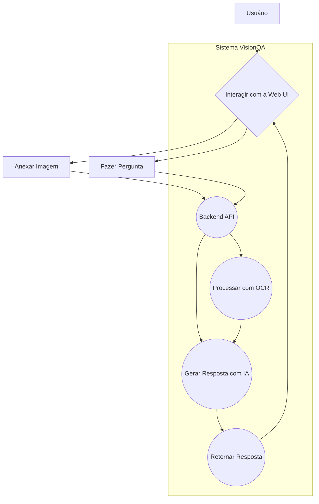
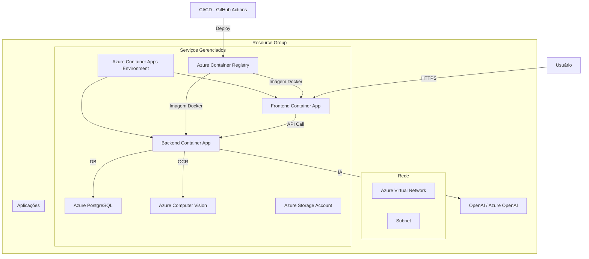
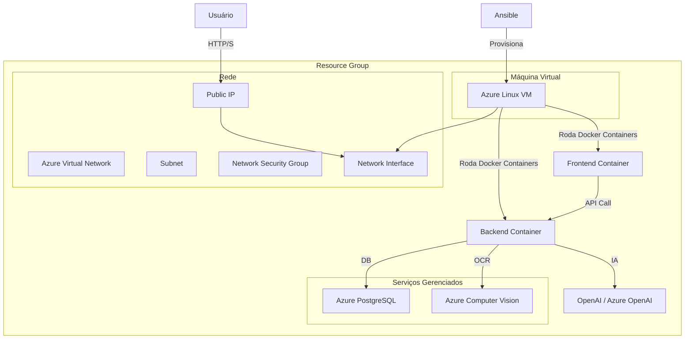

# VisionQA 👁️‍🗨️

**Um sistema inteligente de Perguntas e Respostas (Q&A) que utiliza OCR e IA para analisar o conteúdo de imagens e responder a perguntas sobre elas.**

Este projeto é uma aplicação full-stack completa que integra tecnologias de front-end, back-end, infraestrutura como código (IaC) e provisionamento automatizado para fornecer uma solução robusta e escalável.

---

## ✨ Funcionalidades

A interface do VisionQA foi projetada para ser intuitiva e rica em recursos:

-   **Upload de Imagem Flexível**: Envie imagens via caixa de diálogo, arrastando e soltando (drag-and-drop) ou simplesmente colando da área de transferência (Ctrl+V).
-   **Interface de Chat**: As interações são exibidas em um formato de chat claro e familiar.
-   **Histórico de Conversa**: O histórico da sua sessão é salvo localmente no seu navegador, permitindo que você continue de onde parou.
-   **Modo Escuro**: Alterne entre temas claro, escuro ou o padrão do sistema para maior conforto visual.
-   **Exportação da Conversa**: Exporte o diálogo completo para um arquivo `.txt` com um único clique.
-   **Copiar Resposta**: Copie facilmente a última resposta do assistente para a área de transferência.
-   **Design Responsivo**: A interface se adapta perfeitamente a diferentes tamanhos de tela.

---

## ⚙️ Como Funciona

O fluxo de dados, desde a interação do usuário até a resposta da IA, segue os seguintes passos:

1.  **Interação no Frontend**: O usuário acessa a aplicação web (Next.js), anexa uma imagem e/ou digita uma pergunta.
2.  **Requisição à API**: O frontend envia os dados (imagem e texto da pergunta) para a API backend (Fastify).
3.  **Extração de Texto (OCR)**: O backend recebe a requisição. Se uma imagem for fornecida, ele a envia para o serviço **Azure Computer Vision**, que realiza o OCR e retorna o texto extraído da imagem.
4.  **Construção do Prompt**: O backend combina o texto extraído da imagem com a pergunta do usuário, criando um prompt detalhado para o modelo de linguagem.
5.  **Geração da Resposta (IA)**: O prompt é enviado para um modelo de linguagem grande (LLM). O sistema é configurado para usar **OpenAI (GPT-4o mini, etc.)** ou **Azure OpenAI**, dependendo das variáveis de ambiente configuradas.
6.  **Retorno da Resposta**: A resposta gerada pela IA é enviada de volta para o backend, que a repassa para o frontend.
7.  **Exibição no Chat**: O frontend exibe a resposta do assistente na interface de chat, completando o ciclo.

---

## 🏗️ Arquitetura

O sistema foi projetado com uma arquitetura de microsserviços desacoplada e utiliza as melhores práticas de nuvem.

### Diagrama de Caso de Uso

Este diagrama ilustra as principais interações do usuário com o sistema VisionQA.



### Arquitetura de Serviços

Este diagrama detalha a interação entre o frontend, backend e os serviços externos de nuvem.

```mermaid
graph TD
    subgraph "Cliente"
        A[Navegador do Usuário]
    end

    subgraph "Serviços da Aplicação"
        B[Frontend - Next.js on Azure Container App]
        C[Backend - Fastify on Azure Container App]
    end

    subgraph "Serviços de Nuvem Externos"
        D[Azure Computer Vision (OCR)]
        E[OpenAI / Azure OpenAI (LLM)]
    end

    A -- Requisição HTTP --> B;
    B -- Chamada de API REST --> C;
    C -- Extração de Texto --> D;
    C -- Geração de Resposta --> E;
```

### Arquitetura de Nuvem (Azure)

O projeto suporta duas arquiteturas de implantação na Azure, provisionadas com Terraform.

**Opção 1: Arquitetura Serverless com Azure Container Apps (Recomendado)**

Esta é a abordagem moderna e escalável, ideal para produção.



**Opção 2: Arquitetura baseada em VM com Ansible**

Esta abordagem é mais simples e pode ser usada para desenvolvimento ou ambientes com requisitos específicos de VM.



---

## 🚀 Como Começar

### Pré-requisitos

-   Node.js e npm
-   Docker e Docker Compose
-   Credenciais para Azure e/ou OpenAI (veja `.env.example`)

### Rodando Localmente

1.  **Clone o repositório:**
    ```bash
    git clone <URL_DO_REPOSITORIO>
    cd <NOME_DO_REPOSITORIO>
    ```

2.  **Configure as variáveis de ambiente:**
    Copie o arquivo de exemplo e preencha com suas chaves de API.
    ```bash
    cp .env.example .env
    ```

3.  **Inicie o Backend:**
    ```bash
    cd backend
    npm install
    npm run dev
    # A API estará disponível em http://localhost:8000
    ```

4.  **Inicie o Frontend (em outro terminal):**
    ```bash
    cd frontend
    npm install
    npm run dev
    # A aplicação estará disponível em http://localhost:3000
    ```

---

## ☁️ Implantação na Nuvem (Azure)

Você pode implantar o VisionQA na Azure usando um dos dois métodos abaixo.

### Método 1: Serverless com Container Apps (via Terraform)

Este método provisiona toda a arquitetura recomendada.

1.  **Pré-requisitos:**
    -   Azure CLI e Terraform instalados.
    -   Um Service Principal do Azure com as permissões necessárias.
    -   Configure as variáveis de ambiente `AZURE_CLIENT_ID`, `AZURE_TENANT_ID`, etc.

2.  **Execute o Terraform:**
    ```bash
    cd infrastructure/terraform

    terraform init

    terraform plan \
      -var "postgres_admin_password=SUA_SENHA_SEGURA" \
      -var "vm_admin_ssh_pubkey=$(cat ~/.ssh/id_rsa.pub)"

    terraform apply -auto-approve \
      -var "postgres_admin_password=SUA_SENHA_SEGURA" \
      -var "vm_admin_ssh_pubkey=$(cat ~/.ssh/id_rsa.pub)"
    ```
    *Nota: A chave SSH é necessária para a VM, mesmo que o foco seja em Container Apps.*

### Método 2: VM com Ansible

Este método provisiona a VM com Terraform e a configura com Ansible.

1.  **Provisione a VM com Terraform** (siga os passos do método 1).

2.  **Execute o Ansible Playbook:**
    Obtenha o IP público da VM criada pelo Terraform.
    ```bash
    cd ansible

    ansible-playbook -i inventory.ini playbook.yml \
      -e vm_public_ip=<IP_DA_VM> \
      -e vm_admin_username=azureuser \
      -e ssh_private_key_path=~/.ssh/id_rsa \
      -e openai_api_key=<SUA_CHAVE_OPENAI> \
      # ... e outras variáveis conforme necessário
    ```

---

## 🛠️ Pilha Tecnológica

| Categoria              | Tecnologia / Serviço                               |
| ---------------------- | -------------------------------------------------- |
| **Frontend**           | Next.js, React, Tailwind CSS, TypeScript           |
| **Backend**            | Fastify, Node.js, TypeScript                       |
| **IA & OCR**           | OpenAI / Azure OpenAI, Azure Computer Vision       |
| **Infraestrutura (IaC)** | Terraform, Azure                                   |
| **Provisionamento**    | Ansible                                            |
| **Conteinerização**    | Docker, Docker Compose                             |
| **CI/CD**              | GitHub Actions                                     |
| **Banco de Dados**     | Azure PostgreSQL                                   |
| **Hospedagem**         | Azure Container Apps, Azure VM                     |

---

## 📄 Licença

Este projeto é distribuído sob a licença MIT. Veja o arquivo `LICENSE` para mais detalhes.